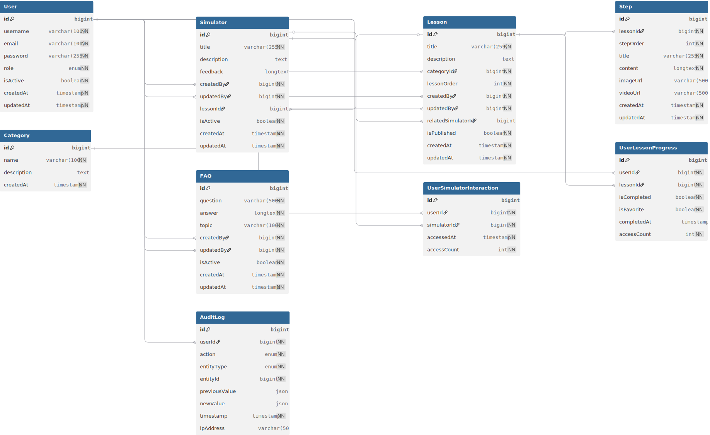

# Plataforma Educativa de Tecnología para Adultos Mayores - Backend

## Índice

- [Descripción del Proyecto](#descripción-del-proyecto)
- [Estado de Implementación](#estado-de-implementación)
- [Alcance del Proyecto](#alcance-del-proyecto---funcionalidades-implementadas)
- [Conceptos Clave](#conceptos-clave)
- [Sistema de Roles y Permisos](#sistema-de-roles-y-permisos)
- [Requisitos Funcionales Implementados](#requisitos-funcionales-implementados)
- [Medición del Progreso](#medición-del-progreso)
- [Requisitos No Funcionales](#requisitos-no-funcionales)
- [Stack Tecnológico](#stack-tecnológico)
- [Estructura del Proyecto](#estructura-del-proyecto)
- [Instalación y Configuración](#instalación-y-configuración)
- [Pruebas](#pruebas)
- [Colección de Postman](#colección-de-postman)
- [Documentación de la API REST](#documentación-de-la-api-rest)
- [Diseño de la Base de Datos](#diseño-de-la-base-de-datos)
- [Consideraciones de Seguridad](#consideraciones-de-seguridad)
- [Documentación Técnica](#documentación-técnica)
- [Mejoras Futuras](#mejoras-futuras)
- [Licencia](#licencia)

---

## Descripción del Proyecto

Esta aplicación es una plataforma interactiva y educativa diseñada específicamente para adultos mayores (entre 65 y 80 años) que deseen aprender a manejar las tecnologías más comunes en su vida cotidiana. El proyecto aborda la brecha digital mediante una propuesta pedagógica centrada en el usuario, con especial enfoque en dispositivos móviles y aplicaciones de uso frecuente.

El backend proporciona una API REST robusta que soporta todas las funcionalidades necesarias para gestionar lecciones, simuladores interactivos, perfiles de usuario e historial de aprendizaje, garantizando una experiencia segura, intuitiva y accesible.

---


## Alcance del Proyecto - Funcionalidades Implementadas

La plataforma implementa las siguientes áreas funcionales:

- **Gestión de Lecciones**: Tutoriales estructurados en pasos que representan una curva de aprendizaje progresiva.
- **Simuladores Interactivos**: Entornos seguros para practicar situaciones comunes del día a día.
- **Autenticación y Autorización**: Sistema de login con JWT, roles de usuario (USER, ADMIN) y control de acceso basado en roles.
- **Perfiles de Usuario**: Información de usuario autenticado, configuración de contraseña y preferencias.
- **Historial y Favoritos**: Seguimiento del progreso del usuario autenticado con capacidad de guardar y revisar lecciones.
- **Sistema de Ayuda**: Preguntas frecuentes (FAQ) y documentación de la plataforma.
- **Gestión de Contenido Administrativo**: Crear, editar y eliminar lecciones y simuladores (solo contenido propio).
- **Auditoría**: Registro de cambios en la plataforma con trazabilidad de acciones.

---

## Conceptos Clave

Antes de profundizar en los requisitos, es importante entender la estructura conceptual de la plataforma:

### Lección

Una **lección** es un tutorial completo y estructurado sobre un tema específico, diseñado para enseñar cómo usar una tecnología.

- Está dividida en **pasos secuenciales** que presentan el contenido de forma gradual
- Cada paso contiene texto, imágenes o videos
- Representa una **curva de aprendizaje progresiva**
- Está asociada a una **categoría** para facilitar búsqueda y organización
- Opcionalmente puede vincularse con un **simulador** para práctica
- Ejemplos: "Cómo enviar un mensaje de WhatsApp", "Cómo hacer una videollamada", "Cómo buscar en Google"

### Paso

Un **paso** es una unidad de contenido individual dentro de una lección.

- Forma parte de una lección específica con un orden secuencial
- Contiene un único concepto o acción a aprender
- Incluye contenido (texto + imagen/video opcional)
- Es mostrado uno a uno al usuario de forma progresiva
- Ejemplo dentro de "Cómo enviar un mensaje de WhatsApp": Paso 1: "Abre WhatsApp", Paso 2: "Busca el contacto", Paso 3: "Escribe tu mensaje", etc.

### Categoría

Una **categoría** es una agrupación temática de lecciones que ayuda a organizar y filtrar el contenido.

- Agrupa lecciones por temática relacionada
- Permite que usuarios naveguen por áreas de interés
- Facilita la medición del progreso por área temática
- Ejemplos: "Redes Sociales", "Mensajería", "Búsqueda en Internet", "Compras Online", "Videollamadas", "Seguridad Digital"

### Simulador

Un **simulador** es un entorno interactivo y seguro donde el usuario practica situaciones reales sin riesgo.

- Es una demostración interactiva de situaciones comunes del día a día
- Proporciona feedback inmediato después de cada acción
- Permite practicar sin consecuencias reales
- Puede estar vinculado opcionalmente a una lección (usuario aprende primero, luego practica)
- Puede usarse de forma independiente
- Ejemplos: simulador de envío de mensajes, simulador de búsqueda en Google, simulador de videollamada

---

## Sistema de Roles y Permisos

La plataforma implementa un sistema de control de acceso basado en dos roles: USER y ADMIN. El acceso se controla mediante:

- **Tokens JWT**: Generados al login, incluyen claims con roles, ID de usuario y fecha de expiración
- **Filtro JWT**: Valida la firma y expiración del token en cada request
- **@PreAuthorize**: Anotaciones en endpoints administrativos para proteger operaciones sensibles
- **Validación de Propiedad**: Los servicios validan que los admins solo editen/eliminen su propio contenido

### Usuario No Autenticado

**Acceso de Lectura:**
- Obtener todas las lecciones publicadas
- Acceder al contenido completo de lecciones (pasos, texto, imágenes, videos)
- Usar simuladores interactivos
- Buscar lecciones por palabra clave o categoría
- Consultar preguntas frecuentes (FAQ)
- Obtener información de categorías

**Limitaciones:**
- No puede guardar lecciones como favoritas
- No puede crear historial de lecciones completadas
- No puede acceder a funcionalidades de perfil
- No puede crear, editar ni eliminar contenido
- No puede acceder a endpoints protegidos que requieren autenticación

### Usuario Autenticado (Rol: USER)

**Acceso a Lectura (igual que no autenticado)**

**Funcionalidades de Perfil:**
- Ver datos personales (username, email, rol, estado)
- Actualizar contraseña

**Funcionalidades de Historial:**
- Guardar lecciones como favoritas
- Marcar lecciones como completadas
- Acceder al historial personal de lecciones vistas
- Obtener progreso global (porcentaje de lecciones completadas)
- Obtener progreso por categoría
- Acceder a historial de interacciones con simuladores

**Limitaciones:**
- No puede crear, editar ni eliminar lecciones
- No puede crear, editar ni eliminar simuladores
- No puede gestionar FAQ
- No puede ver información de otros usuarios
- No puede acceder a endpoints administrativos

### Administrador (Rol: ADMIN)

**Todo lo permitido para usuarios autenticados, más:**

**Gestión de Lecciones (Protegido con @PreAuthorize):**
- Crear nuevas lecciones (requiere rol ADMIN)
- Editar únicamente lecciones que él mismo ha creado (validación en servicio)
- Eliminar sus propias lecciones (eliminación en cascada de pasos)
- Crear pasos dentro de sus lecciones
- Editar pasos de sus lecciones
- Eliminar pasos de sus lecciones
- Publicar/despublicar lecciones

**Gestión de Simuladores (Protegido con @PreAuthorize):**
- Crear nuevos simuladores interactivos
- Editar únicamente simuladores que él mismo ha creado (validación en servicio)
- Eliminar sus propios simuladores
- Asociar simuladores con lecciones

**Gestión de Categorías (Protegido con @PreAuthorize):**
- Crear nuevas categorías
- Editar categorías
- Eliminar categorías (si no tienen lecciones)

**Gestión de FAQ (Protegido con @PreAuthorize):**
- Crear nuevas preguntas frecuentes
- Editar preguntas que ha creado
- Eliminar sus propias FAQ

**Gestión de Usuarios y Auditoría (Protegido con @PreAuthorize):**
- Listar todos los usuarios registrados
- Ver perfiles de otros usuarios y estadísticas
- Ver estadísticas de actividad de usuarios
- Desactivar cuentas de usuario
- Ver logs de auditoría de cambios en la plataforma
- Filtrar y buscar en logs de auditoría

**Limitaciones:**
- No puede editar contenido creado por otros administradores
- No puede cambiar el rol de otros usuarios
- Solo puede editar/eliminar contenido que él ha creado (excepto en gestión de categorías)

---

## Requisitos Funcionales Implementados

### Autenticación y Autorización

- Sistema de registro (POST /api/auth/register) con validación de duplicados (username, email)
- Sistema de login (POST /api/auth/login) con validación de credenciales
- Tokens JWT con claims: sub (username), roles, exp, jti
- Filtro JWT que valida firma y expiración en cada request
- Blacklist de tokens en memoria para invalidación en logout
- Endpoint GET /api/auth/me para obtener usuario autenticado
- Endpoint POST /api/auth/logout para cerrar sesión
- Gestión de roles de usuario (USER, ADMIN)
- Control de acceso basado en roles mediante @PreAuthorize
- Validación de propiedad de contenido (solo admins pueden editar su propio contenido)
- Contraseñas hasheadas con BCrypt

### Gestión de Lecciones

**Usuarios (no autenticados):**
- GET /api/lessons - Obtener todas las lecciones publicadas
- GET /api/lessons/{id} - Obtener lección por ID con pasos incluidos
- GET /api/lessons/search - Buscar lecciones por palabra clave
- GET /api/lessons/category/{categoryId} - Obtener lecciones por categoría
- GET /api/lessons/trending - Obtener lecciones trending (más accedidas)
- GET /api/lessons/with-simulator - Obtener lecciones con simulador

**Usuarios (autenticados):**
- Todas las funcionalidades anteriores, más:
- Acceso a endpoints de historial y favoritos (ver Historial y Seguimiento)

**Administradores (Protegido con @PreAuthorize):**
- POST /api/lessons - Crear nueva lección
- PUT /api/lessons/{id} - Actualizar lección (solo si es autor)
- DELETE /api/lessons/{id} - Eliminar lección (solo si es autor, con eliminación en cascada)
- POST /api/lessons/{id}/publish - Publicar lección (requiere >= 1 paso)
- POST /api/lessons/{id}/unpublish - Despublicar lección
## Colección de Postman

Se proporciona una colección completa de Postman para probar todos los endpoints sin necesidad de código.

### Contenido

La colección incluye:
- 40+ requests organizados en 8 carpetas temáticas
- Variables configurables (jwt_token, base_url)
- Ejemplos de uso para cada endpoint
- Documentación de parámetros y respuestas
- Configuración de headers (Authorization, Content-Type)

### Cómo Usar

1. **Descargar la colección**: `Postman_Coleccion.json`
2. **Importar en Postman**:
    - File → Import → Seleccionar archivo JSON
3. **Configurar variables**:
    - jwt_token: Obtén un token haciendo login
    - base_url: http://localhost:8080 (por defecto)
4. **Probar endpoints**: Selecciona un request y haz clic en Send

### Documentación Detallada

Para una guía completa sobre cómo usar la colección, incluyendo:
- Instalación y configuración
- Estructura de carpetas
- Flujos completos (registro → crear lección → publicar)
- Troubleshooting y errores comunes
- Ejemplos de variables y entornos

Consulta: [**POSTMAN_DOCUMENTACION.md**](POSTMAN_DOCUMENTACION.md)

---

## Consideraciones de Seguridad
### Gestión de Pasos

**Usuarios (no autenticados):**
- GET /api/lessons/{lessonId}/steps - Obtener todos los pasos de una lección

**Administradores (Protegido con @PreAuthorize):**
- POST /api/lessons/{lessonId}/steps - Crear nuevo paso
- PUT /api/lessons/{lessonId}/steps/{stepId} - Actualizar paso
- DELETE /api/lessons/{lessonId}/steps/{stepId} - Eliminar paso

### Gestión de Categorías

**Usuarios (no autenticados):**
- GET /api/categories - Obtener todas las categorías
- GET /api/categories/{id} - Obtener categoría por ID

**Administradores (Protegido con @PreAuthorize):**
- POST /api/categories - Crear nueva categoría
- PUT /api/categories/{id} - Actualizar categoría
- DELETE /api/categories/{id} - Eliminar categoría

### Gestión de Simuladores

**Usuarios (no autenticados):**
- GET /api/simulators - Obtener todos los simuladores
- GET /api/simulators/{id} - Obtener simulador por ID

**Administradores (Protegido con @PreAuthorize):**
- POST /api/simulators - Crear nuevo simulador
- PUT /api/simulators/{id} - Actualizar simulador (solo si es autor)
- DELETE /api/simulators/{id} - Eliminar simulador (solo si es autor)

### Perfiles de Usuario (Autenticado)

- GET /api/users/{id} - Obtener datos del usuario autenticado (sin password)
- PUT /api/users/{id} - Actualizar perfil del usuario (email, contraseña)
- PUT /api/users/{id}/status - Desactivar cuenta (solo el mismo usuario)

### Historial y Seguimiento (Autenticado)

- GET /api/progress - Obtener estadísticas de progreso del usuario
- POST /api/progress/{lessonId}/mark-complete - Marcar lección como completada
- POST /api/progress/{lessonId}/favorite - Guardar lección como favorita
- DELETE /api/progress/{lessonId}/favorite - Eliminar de favoritos
- GET /api/progress/category/{categoryId} - Obtener progreso por categoría
- GET /api/progress/simulator-interactions - Obtener historial de interacciones con simuladores

### Sistema de Ayuda (Preguntas Frecuentes)

**Usuarios (no autenticados):**
- GET /api/faq - Obtener todas las FAQ
- GET /api/faq/search - Buscar en FAQ por palabra clave

**Administradores (Protegido con @PreAuthorize):**
- POST /api/faq - Crear nueva FAQ
- PUT /api/faq/{id} - Actualizar FAQ (solo si es autor)
- DELETE /api/faq/{id} - Eliminar FAQ (solo si es autor)

### Gestión de Usuarios (Administrador - Protegido con @PreAuthorize)

- GET /api/admin/users - Listar todos los usuarios (paginado)
- GET /api/admin/users/{id} - Obtener detalles de usuario
- PUT /api/admin/users/{id}/status - Activar/Desactivar cuenta de usuario

### Auditoría (Administrador - Protegido con @PreAuthorize)

- GET /api/admin/audit-logs - Obtener todos los logs de auditoría (paginado)
- GET /api/admin/audit-logs/search - Filtrar logs por usuario, acción o tipo de entidad
- GET /api/admin/audit-logs/user/{userId} - Obtener logs de un usuario específico
- GET /api/admin/audit-logs/action/{action} - Filtrar logs por acción
- GET /api/admin/audit-logs/entity/{entityType} - Filtrar logs por tipo de entidad

---

## Medición del Progreso

El sistema de progreso está implementado para rastrear el aprendizaje individual del usuario autenticado.

### Unidades de Medición Implementadas

**Lección Completada**
- Una lección se marca como completada mediante POST /api/progress/{lessonId}/mark-complete
- Requiere autenticación (usuarios no autenticados no pueden marcar)
- Se registra la fecha de completación en UserLessonProgress.completedAt
- Se cuenta el número de accesos a la lección en UserLessonProgress.accessCount

**Progreso Global**
- Calcula el porcentaje de lecciones completadas en toda la plataforma
- Accesible mediante GET /api/progress
- Fórmula: `(Total lecciones completadas / Total lecciones publicadas) × 100`

**Progreso por Categoría**
- Calcula el porcentaje de lecciones completadas en cada categoría
- Accesible mediante GET /api/progress/category/{categoryId}
- Permite al usuario ver en qué áreas temáticas ha avanzado

**Favoritos**
- Los usuarios pueden marcar lecciones como favoritas mediante POST /api/progress/{lessonId}/favorite
- Se almacena en UserLessonProgress.isFavorite
- Se pueden consultar y eliminar

**Acceso a Simuladores**
- Se registra cada vez que el usuario accede a un simulador
- Se cuenta el número de accesos en UserSimulatorInteraction.accessCount
- Se almacena el timestamp en UserSimulatorInteraction.accessedAt

---

## Requisitos No Funcionales

- **Seguridad**: Validación de entrada con @Valid, protección contra inyección SQL mediante JPA, contraseñas hasheadas con BCrypt, tokens JWT con expiración, filtro JWT en cada request, CORS configurado, logs de auditoría
- **Rendimiento**: API responde con tiempos adecuados, paginación implementada, índices en tablas principales
- **Escalabilidad**: Diseño preparado para múltiples usuarios concurrentes, uso de transacciones
- **Accesibilidad**: Respuestas JSON estructuradas, DTOs sin exponer contraseñas, códigos HTTP semánticos
- **Testing**: Test dummy implementado, cobertura mejorable (actual: mínima)

---

## Stack Tecnológico

El backend está implementado con **Spring Boot 3.5.6**, un framework Java moderno que proporciona:

- Inyección de dependencias mediante Spring IoC
- Gestión automática de transacciones con @Transactional
- ORM mediante JPA/Hibernate
- Spring Security para autenticación y autorización
- Spring Data JPA para acceso a base de datos
- Validación con Jakarta Validation (Bean Validation)
- Manejo de excepciones global con @ControllerAdvice

### Dependencias Principales

- **spring-boot-starter-web**: API REST
- **spring-boot-starter-data-jpa**: Acceso a base de datos
- **spring-boot-starter-security**: Autenticación y autorización
- **spring-boot-starter-validation**: Validación de datos
- **jjwt**: Generación y validación de tokens JWT
- **h2database**: Base de datos en memoria (desarrollo)
- **lombok**: Reducción de código boilerplate
- **springdoc-openapi**: Generación de documentación OpenAPI (en pom.xml, sin configurar)

---

## Estructura del Proyecto

```
backend/
├── .mvn/                           # Maven Wrapper
├── mvnw                            # Maven Wrapper (Linux/Mac)
├── mvnw.cmd                        # Maven Wrapper (Windows)
├── pom.xml                         # Configuración de dependencias Maven
│
├── src/
│   ├── main/
│   │   ├── java/
│   │   │   ├── AplicacionEducativa.java    # Clase principal (@SpringBootApplication)
│   │   │   │
│   │   │   ├── model/              # Entidades JPA (9 clases)
│   │   │   ├── config/             # Configuración de Spring
│   │   │   ├── repository/         # Interfaces JpaRepository (9 repos)
│   │   │   ├── service/            # Lógica de negocio (9 servicios)
│   │   │   ├── controller/         # Controladores REST (9+ controladores)
│   │   │   ├── dto/                # Data Transfer Objects
│   │   │   ├── exception/          # Excepciones y manejadores
│   │   │   └── security/           # JWT y seguridad
│   │   │
│   │   └── resources/
│   │       └── application.properties
│   │
│   └── test/
│       └── java/
│           └── com/example/backend/AplicacionSaludoTest.java

```

### Descripción de Paquetes

| Paquete | Descripción | Status |
|---------|-------------|--------|
| **model** | Entidades JPA mapeadas con relaciones (9 clases) | Completo |
| **config** | Configuración de Spring (JPA, transacciones, Security, CORS) | Completo |
| **repository** | Interfaces JpaRepository con consultas personalizadas (9 repos, 60+ consultas) | Completo |
| **service** | Lógica de negocio y operaciones CRUD (9 servicios) | Completo |
| **controller** | Controladores REST con @PreAuthorize (9+ controladores) | Completo |
| **dto** | Data Transfer Objects request/response | Completo |
| **exception** | Excepciones personalizadas y GlobalExceptionHandler | Completo |
| **security** | JwtTokenProvider, JwtAuthenticationFilter, TokenBlacklistService, SecurityConfig | Completo |

---

## Instalación y Configuración

### Requisitos Previos

- Java 21 o superior
- Maven 3.6.0 o superior
- H2 Database (en memoria, incluido con Spring Boot) o MySQL 8.0

### Pasos de Instalación

1. **Clonar el repositorio**
   ```bash
   cd backend
   ```

2. **Construir el proyecto**
   ```bash
   ./mvnw clean compile
   ```

   O en Windows:
   ```cmd
   mvnw.cmd clean compile
   ```

3. **Ejecutar la aplicación**
   ```bash
   ./mvnw spring-boot:run
   ```

   O en Windows:
   ```cmd
   mvnw.cmd spring-boot:run
   ```

4. **Acceder a la API**

   La API estará disponible en: `http://localhost:8080`

### Configuración

El archivo `src/main/resources/application.properties` contiene la configuración por defecto:

- Base de datos: H2 en memoria (jdbc:h2:mem:testdb)
- Puerto: 8080
- Context path: /api
- JWT expiration: 86400000 ms (24 horas)
- JWT secret: configurable en application.properties

Para cambiar a MySQL u otra base de datos, editar `application.properties`:
```properties
spring.datasource.url=jdbc:mysql://localhost:3306/nombre_base_datos
spring.datasource.username=usuario
spring.datasource.password=contraseña
```

---

## Pruebas

Actualmente existe un test básico en:
```
src/test/java/com/example/backend/AplicacionSaludoTest.java
```

Para ejecutar las pruebas:
```bash
./mvnw test
```

Nota: La cobertura de tests es mínima. Se recomienda ampliar la cobertura a endpoints, servicios y autenticación en versiones futuras.

---

## Documentación de la API REST

Se proporciona documentación exhaustiva de todos los endpoints de la API incluyendo parámetros, respuestas, códigos HTTP y ejemplos.

### Contenido

La documentación incluye:
- Descripción detallada de 40+ endpoints
- Request/Response examples para cada endpoint
- Parámetros de entrada y tipos de datos
- Códigos HTTP esperados (200, 201, 204, 400, 401, 403, 404, 409, 422, 500)
- Ejemplos de mensajes de error
- Flujos completos de casos de uso
- Modelos de datos estándar (pagination, errors, auth)
- Configuración de CORS
- Headers requeridos

### Organización

Los endpoints están documentados por categoría:
- Autenticación (4 endpoints)
- Lecciones (11 endpoints)
- Pasos (4 endpoints)
- Categorías (5 endpoints)
- Simuladores (5 endpoints)
- Progreso y Favoritos (6 endpoints)
- FAQ (5 endpoints)
- Administración (4 endpoints)

### Documentación Disponible

1. **API_DOCUMENTACION.md** - Referencia técnica completa con descripción de cada endpoint, request/response y ejemplos
2. **MATRIZ_HTTP_ENDPOINTS.md** - Tabla detallada de códigos HTTP esperados por endpoint y condición de error

Para la documentación completa:
- [API_DOCUMENTACION.md](API_DOCUMENTACION.md) - Guía exhaustiva de todos los endpoints
- [MATRIZ_HTTP_ENDPOINTS.md](MATRIZ_HTTP_ENDPOINTS.md) - Códigos HTTP específicos (200, 201, 204, 400, 401, 403, 404, 409, 422, 500)

---

## Diseño de la Base de Datos

### Diagrama Entidad-Relación



### Documentación Detallada

Para documentación completa del modelo de datos, incluyendo descripción detallada de cada tabla, relaciones, constraints e índices, consulte el archivo [**MODELO_DATOS.md**](MODELO_DATOS.md).

El documento incluye:
- Descripción completa de cada entidad
- Campos, tipos y constraints
- Relaciones entre tablas
- Estrategia de índices para optimización
- Cálculos de progreso
- Consideraciones de diseño

### Entidades Principales (Resumen)

**User** - Usuario de la plataforma
- id (PK, Long)
- username (String, unique, not null)
- email (String, unique, not null)
- password (String, hasheada con BCrypt)
- role (Enum: USER, ADMIN)
- isActive (Boolean)
- createdAt, updatedAt (LocalDateTime)

**Category** - Agrupación temática de lecciones
- id (PK, Long)
- name (String, unique, not null)
- description (String, nullable)
- createdAt, updatedAt (LocalDateTime)

**Lesson** - Tutorial estructurado
- id (PK, Long)
- title, description (String)
- categoryId (FK → Category)
- lessonOrder (Integer)
- createdBy (FK → User)
- relatedSimulatorId (FK → Simulator, nullable)
- isPublished (Boolean)
- createdAt, updatedAt (LocalDateTime)
- updatedBy (FK → User)

**Step** - Unidad de contenido dentro de una lección
- id (PK, Long)
- lessonId (FK → Lesson)
- stepOrder (Integer)
- title, content (String)
- imageUrl, videoUrl (String, nullable)
- createdAt, updatedAt (LocalDateTime)

**Simulator** - Entorno interactivo de práctica
- id (PK, Long)
- title, description, feedback (String)
- createdBy (FK → User)
- isActive (Boolean)
- createdAt, updatedAt (LocalDateTime)
- updatedBy (FK → User)

**UserLessonProgress** - Seguimiento de progreso
- id (PK, Long)
- userId, lessonId (FK)
- isCompleted, isFavorite (Boolean)
- completedAt (LocalDateTime, nullable)
- accessCount (Integer)
- unique(userId, lessonId)

**UserSimulatorInteraction** - Interacción con simuladores
- id (PK, Long)
- userId, simulatorId (FK)
- accessedAt (LocalDateTime)
- accessCount (Integer)

**FAQ** - Preguntas frecuentes
- id (PK, Long)
- question, answer, topic (String)
- createdBy, updatedBy (FK → User)
- isActive (Boolean)
- createdAt, updatedAt (LocalDateTime)

**AuditLog** - Registro de auditoría
- id (PK, Long)
- userId (FK → User)
- action (Enum: CREATE, UPDATE, DELETE, DISABLE_ACCOUNT)
- entityType (Enum: LESSON, SIMULATOR, FAQ, USER, CATEGORY, STEP)
- entityId (Long)
- previousValue, newValue (String, nullable)
- timestamp (LocalDateTime)
- ipAddress (String, nullable)

---

## Consideraciones de Seguridad

La plataforma implementa las siguientes medidas de seguridad:

- Contraseñas hasheadas con BCrypt (algoritmo adaptivo con factor de coste configurable)
- Tokens JWT firmados con HMAC-SHA256 con expiración (24 horas por defecto)
- Filtro JWT que valida firma y expiración en cada request
- Blacklist de tokens en memoria para invalidación en logout (hasta expiración)
- CORS configurado para orígenes específicos (localhost:4200, localhost:3000)
- Validación de entrada en todos los endpoints mediante @Valid y DTOs
- Protección contra inyección SQL mediante JPA/Hibernate
- Logs de auditoría para acciones sensibles (tabla AuditLog)
- Control de acceso basado en roles mediante @PreAuthorize
- Validación de propiedad de contenido (admins solo pueden editar su propio contenido)
- DTOs que no exponen campos sensibles (como contraseñas)
- SecurityFilterChain con autenticación y autorización

---

## Documentación Técnica

Para documentación detallada del modelo de datos, incluyendo descripción de entidades, relaciones y diseño, consulte:

```
DWES/MODELO_DATOS.md
```

---

## Mejoras Futuras

- Implementar tests automatizados con cobertura >= 70%
- Documentación Swagger/OpenAPI completa
- Colecciones de Postman para testing manual
- Migraciones SQL (Flyway/Liquibase)
- Caché (Redis) para datos frecuentemente accedidos
- Rate limiting para endpoints públicos
- Notificaciones por email
- Sistema de recomendaciones basado en historial
- Exportación de reportes de progreso

---

## Licencia

Proyecto educativo. Derechos reservados IES Rafael Alberti.

---

**Última actualización**: Diciembre 2025