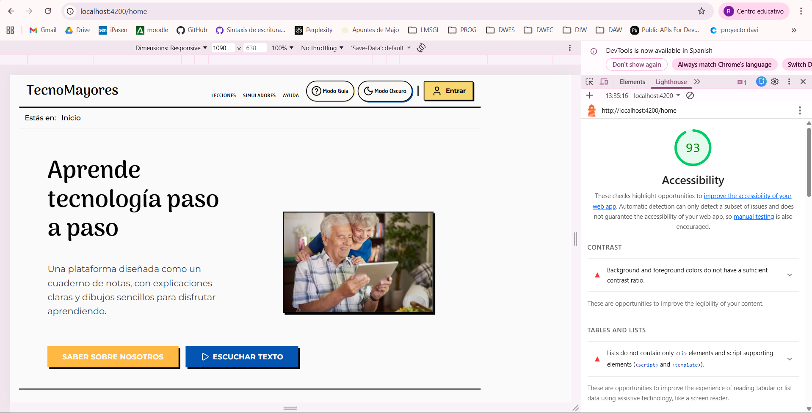
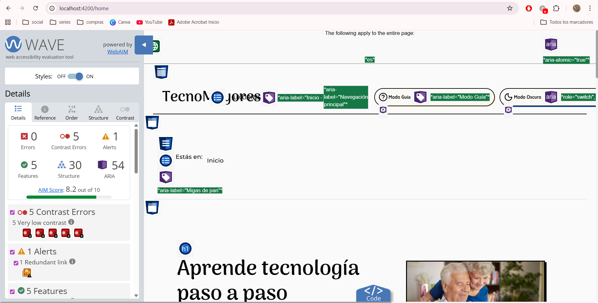
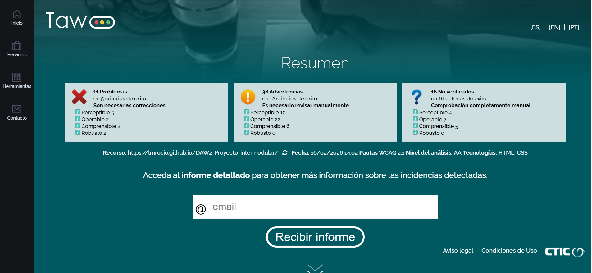

# Análisis de Accesibilidad - TecnoMayores

> **Proyecto:** TecnoMayores - Plataforma de alfabetización digital para personas mayores  
> **Autora:** Rocío Luque Montes   
> **Fecha:** 16 de febrero de 2026  
> **Nivel de conformidad objetivo:** WCAG 2.1 Nivel AA

---

## Índice

1. [Fundamentos de Accesibilidad](#sección-1-fundamentos-de-accesibilidad)
2. [Componente Multimedia Implementado](#sección-2-componente-multimedia-implementado)
3. [Auditoría Automatizada Inicial](#sección-3-auditoría-automatizada-inicial)
4. [Análisis y Corrección de Errores](#sección-4-análisis-y-corrección-de-errores)
5. [Análisis de Estructura Semántica](#sección-5-análisis-de-estructura-semántica)
6. [Verificación Manual](#sección-6-verificación-manual)
7. [Resultados Finales](#sección-7-resultados-finales-después-de-correcciones)
8. [Conclusiones y Reflexión](#sección-8-conclusiones-y-reflexión)

---

## Sección 1: Fundamentos de Accesibilidad

### 1.1 ¿Por qué es necesaria la accesibilidad web?

La accesibilidad web es fundamental para garantizar que todas las personas, independientemente de sus capacidades, puedan acceder a la información y servicios digitales. En TecnoMayores, esta necesidad cobra especial relevancia dado que mi público objetivo son personas mayores que frecuentemente presentan discapacidades visuales (presbicia, cataratas, degeneración macular), auditivas (pérdida de audición relacionada con la edad), motoras (artritis, temblores, reducción de precisión) y cognitivas (dificultades de memoria, menor velocidad de procesamiento).

He comprobado que la accesibilidad beneficia a todos los usuarios: textos legibles, navegación clara y contenido multimedia con alternativas mejoran la experiencia de cualquier persona. En España, el Real Decreto 1112/2018 y la Directiva Europea 2016/2102 establecen la obligatoriedad de que los sitios web del sector público y servicios esenciales cumplan con estándares de accesibilidad, por lo que esto no solo es una buena práctica, sino un requisito legal.

### 1.2 Los 4 Principios de WCAG 2.1

Las Pautas de Accesibilidad para el Contenido Web (WCAG) 2.1 se organizan en torno a cuatro principios fundamentales, conocidos por el acrónimo **POUR** (Perceivable, Operable, Understandable, Robust):

#### 1. Perceptible
> La información y los componentes de la interfaz deben presentarse de formas que los usuarios puedan percibir.

**Explicación:** El contenido debe poder ser percibido por al menos uno de los sentidos del usuario, ya sea mediante la vista, el oído o el tacto.

**Ejemplo en TecnoMayores:**  
En mi componente `VideoTutorialComponent`, he implementado subtítulos en español e inglés mediante etiquetas `<track>` para usuarios con discapacidad auditiva. Además, he incluido una transcripción completa en texto plano debajo del video, permitiendo que usuarios sordos o con dificultades auditivas accedan al contenido. Las imágenes de la plataforma incluyen textos alternativos descriptivos (`alt`) que los lectores de pantalla pueden anunciar.

```html
<!-- Ejemplo real de TecnoMayores: subtítulos accesibles -->
<track kind="subtitles" src="tutorial-bizum.vtt" srclang="es" label="Español" default>
<track kind="subtitles" src="tutorial-bizum-en.vtt" srclang="en" label="English">
```

---

#### 2. Operable
> Los componentes de la interfaz y la navegación deben ser operables por todos los usuarios.

**Explicación:** Los usuarios deben poder interactuar con todos los controles y elementos de navegación, independientemente de si usan ratón, teclado, voz u otras tecnologías de asistencia.

**Ejemplo en TecnoMayores:**  
Todos los botones de mi plataforma tienen un tamaño mínimo de 48x48 píxeles, cumpliendo con las recomendaciones WCAG AAA para áreas táctiles. Esto es especialmente importante para personas mayores con artritis o temblores. Además, he implementado estados de foco visibles (`focus-visible`) en todos los elementos interactivos, permitiendo la navegación completa mediante teclado. El reproductor de video utiliza controles nativos de HTML5 que son completamente accesibles por teclado.

```scss
/* Mixin de TecnoMayores para botones accesibles */
@mixin button-accessible($size: 'lg') {
  min-height: 48px;  /* Cumple WCAG AAA */
  min-width: 48px;
  @include focus-visible;  /* Foco visible para navegación por teclado */
}
```

---

#### 3. Comprensible
> La información y el funcionamiento de la interfaz deben ser comprensibles.

**Explicación:** El contenido debe ser legible y predecible. Los usuarios deben poder entender la información y cómo funciona la interfaz sin confusión.

**Ejemplo en TecnoMayores:**  
El servicio de síntesis de voz (`SpeechService`) que he implementado permite a los usuarios escuchar cualquier texto de la plataforma con un simple clic en el botón "Escuchar". Esto beneficia especialmente a personas mayores con dificultades de lectura o fatiga visual. He utilizado un lenguaje sencillo y directo en todas las instrucciones, evitando jerga técnica. Los pasos de cada lección se presentan de forma secuencial y numerada, facilitando el seguimiento.

```typescript
// Servicio de síntesis de voz de TecnoMayores
async speak(text: string): Promise<void> {
  const utterance = new SpeechSynthesisUtterance(text);
  utterance.lang = 'es-ES';  // Idioma español
  utterance.rate = 1;        // Velocidad normal (ajustable)
  // Selecciona voz española automáticamente
}
```

---

#### 4. Robusto
> El contenido debe ser lo suficientemente robusto para ser interpretado por una amplia variedad de agentes de usuario, incluidas las tecnologías de asistencia.

**Explicación:** El código debe seguir los estándares web para garantizar compatibilidad con navegadores actuales y futuros, así como con tecnologías de asistencia como lectores de pantalla.

**Ejemplo en TecnoMayores:**  
He utilizado HTML5 semántico con landmarks apropiados (`<header>`, `<nav>`, `<main>`, `<footer>`) que los lectores de pantalla interpretan correctamente. El componente de video incluye atributos ARIA (`aria-label`, `role="region"`) para proporcionar contexto adicional a las tecnologías de asistencia. Además, he incluido un mensaje de respaldo para navegadores sin soporte de video HTML5.

```html
<!-- Estructura semántica y ARIA en TecnoMayores -->
<video controls [attr.aria-label]="videoTitle">
  <!-- Mensaje de respaldo para navegadores antiguos -->
  <p class="video-fallback">
    Lo sentimos, tu navegador no soporta la reproducción de video.
  </p>
</video>
<div role="region" aria-label="Transcripción del video">
  <!-- Transcripción accesible -->
</div>
```

---

### 1.3 Niveles de Conformidad WCAG

Las WCAG 2.1 definen tres niveles de conformidad que representan diferentes grados de accesibilidad:

| Nivel | Descripción | Requisito |
|-------|-------------|-----------|
| **A** | Nivel mínimo de accesibilidad | Elimina las barreras más críticas. Sin él, algunos usuarios no pueden acceder al contenido en absoluto. |
| **AA** | Nivel intermedio (recomendado) | Elimina barreras significativas. Es el **estándar legal** en España y la UE para sitios web públicos. |
| **AAA** | Nivel máximo de accesibilidad | Proporciona la mejor experiencia posible. No siempre es alcanzable para todo el contenido. |

#### Objetivo de TecnoMayores: Nivel AA

Mi objetivo es alcanzar el nivel AA de conformidad, que es:
- El estándar requerido por la legislación española y europea
- El nivel que garantiza acceso a la gran mayoría de usuarios con discapacidad
- Un equilibrio realista entre accesibilidad óptima y recursos de desarrollo

Adicionalmente, he implementado algunas mejoras de nivel AAA especialmente relevantes para mi público objetivo (personas mayores):
- Contraste mejorado en textos importantes
- Tamaños de fuente base de 16px (superior al mínimo)
- Áreas táctiles de 48x48px (recomendación AAA)
- Síntesis de voz para contenido textual

---

## Sección 2: Componente Multimedia Implementado

### 2.1 Tipo de Componente

**Reproductor de Video Accesible** (`VideoTutorialComponent`)

### 2.2 Descripción del Componente

El `VideoTutorialComponent` es un reproductor de video HTML5 diseñado específicamente para la plataforma TecnoMayores, con un enfoque prioritario en la accesibilidad para personas mayores. El componente reproduce tutoriales educativos (como "Qué es Bizum y cómo funciona") e incluye múltiples alternativas para garantizar que el contenido sea accesible independientemente de las capacidades del usuario.

**Ubicación:** `src/app/components/shared/video-tutorial/`

**Archivos del componente:**
- `video-tutorial.component.ts` - Lógica del componente
- `video-tutorial.component.html` - Plantilla HTML
- `video-tutorial.component.scss` - Estilos CSS

### 2.3 Características de Accesibilidad Implementadas

El componente implementa las siguientes características de accesibilidad, alineadas con los criterios WCAG 2.1:

#### 1. Controles Nativos de HTML5
```html
<video class="video-player" controls [attr.aria-label]="videoTitle" preload="metadata">
```

- **Atributo `controls`:** Proporciona controles de reproducción nativos del navegador (play, pausa, volumen, pantalla completa, barra de progreso)
- **Beneficio:** Los controles nativos son completamente accesibles por teclado y compatibles con lectores de pantalla sin necesidad de JavaScript adicional
- **WCAG:** Cumple criterio **2.1.1 Teclado** (Nivel A)

#### 2. Subtítulos Multilingües con WebVTT
```html
<track kind="subtitles" [src]="subtitlesEsPath" srclang="es" label="Español" default>
<track kind="subtitles" [src]="subtitlesEnPath" srclang="en" label="English">
```

- **Formato WebVTT:** Estándar W3C para subtítulos web, con timestamps precisos
- **Idiomas:** Español (por defecto) e inglés disponibles
- **Atributo `default`:** Los subtítulos en español se activan automáticamente
- **Archivos VTT:**
  - `assets/subtitles/tutorial-bizum.vtt` (español)
  - `assets/subtitles/tutorial-bizum-en.vtt` (inglés)
- **WCAG:** Cumple criterio **1.2.2 Subtítulos (grabados)** (Nivel A)

**Ejemplo del archivo VTT:**
```vtt
WEBVTT

00:00:00.000 --> 00:00:03.000
Hola, hoy vamos a hablar de una
herramienta que simplifica algo que

00:00:03.000 --> 00:00:06.000
hacemos todos los días, los pagos.
```

#### 3. Transcripción Completa Integrada
```html
<details class="transcription-section">
  <summary class="transcription-summary">
    <span class="material-symbols-outlined">description</span>
    <h3 class="transcription-title">Transcripción completa del video</h3>
    <span class="material-symbols-outlined">expand_more</span>
  </summary>
  <div class="transcription-content" role="region" aria-label="Transcripción del video" 
       [innerHTML]="formattedTranscription">
  </div>
</details>
```

- **Elemento `<details>`:** Desplegable nativo accesible por teclado
- **Transcripción formateada:** El texto se divide automáticamente en párrafos para mejorar la legibilidad
- **Atributos ARIA:** `role="region"` y `aria-label` para identificar la sección ante lectores de pantalla
- **Beneficio:** Proporciona una alternativa textual completa para usuarios sordos, con dificultades auditivas, o que prefieren leer
- **WCAG:** Cumple criterio **1.2.1 Solo audio y solo vídeo (grabado)** (Nivel A) y contribuye a **1.2.3 Audiodescripción o alternativa multimedia** (Nivel A)

**Procesamiento inteligente de la transcripción:**
```typescript
get formattedTranscription(): string {
  // Divide el texto en párrafos de 3-4 oraciones para mejor legibilidad
  const sentences = this.transcription.split('. ');
  const paragraphs: string[] = [];
  
  for (let i = 0; i < sentences.length; i += 3) {
    const paragraphSentences = sentences.slice(i, i + 3);
    paragraphs.push(`<p>${paragraphSentences.join('. ')}.</p>`);
  }
  
  return paragraphs.join('');
}
```

#### 4. Etiquetado ARIA para Tecnologías de Asistencia
```html
<video [attr.aria-label]="videoTitle">
```

- **`aria-label` dinámico:** Describe el contenido del video para lectores de pantalla
- **Valor configurable:** Se puede personalizar para cada instancia del componente
- **WCAG:** Cumple criterio **4.1.2 Nombre, función, valor** (Nivel A)

#### 5. Mensaje de Respaldo para Navegadores Incompatibles
```html
<p class="video-fallback">
  Lo sentimos, tu navegador no soporta la reproducción de video.
  Por favor, actualiza tu navegador o descarga el video para verlo.
</p>
```

- **Degradación elegante:** Usuarios con navegadores antiguos reciben un mensaje informativo
- **WCAG:** Contribuye a la robustez del contenido (Principio 4)

#### 6. Diseño Responsive y Accesible
```scss
.video-player {
  width: 100%;
  height: auto;
  
  &:focus {
    outline: $border-medium solid $color-accent;
    outline-offset: 2px;
  }
  
  &::cue {
    background-color: rgba(0, 0, 0, 0.8);
    color: $color-text-light;
    font-size: $font-size-base;
  }
}
```

- **Video responsive:** Se adapta al ancho del contenedor
- **Foco visible:** Borde de color accent cuando el video tiene el foco
- **Subtítulos estilizados:** Fondo oscuro semitransparente para máximo contraste
- **WCAG:** Cumple criterio **2.4.7 Foco visible** (Nivel AA)

### 2.4 Resumen de Cumplimiento WCAG

| Criterio WCAG | Nivel | Estado | Implementación |
|---------------|-------|--------|----------------|
| 1.2.1 - Solo audio/vídeo | A | Cumple | Transcripción completa |
| 1.2.2 - Subtítulos | A | Cumple | Archivos VTT en ES/EN |
| 2.1.1 - Teclado | A | Cumple | Controles nativos HTML5 |
| 2.4.7 - Foco visible | AA | Cumple | Outline en :focus |
| 4.1.2 - Nombre, función, valor | A | Cumple | aria-label en video |

### 2.5 Uso del Componente

```html
<app-video-tutorial
  videoSrc="Qué_es_Bizum_y_cómo_funciona.webm"
  subtitlesEs="tutorial-bizum.vtt"
  subtitlesEn="tutorial-bizum-en.vtt"
  videoTitle="Tutorial sobre Bizum - Qué es y cómo funciona"
  [transcription]="videoTranscripcion()"
></app-video-tutorial>
```

**Inputs configurables:**
| Input | Tipo | Descripción |
|-------|------|-------------|
| `videoSrc` | string | Ruta del archivo de video (relativa a `assets/videos/`) |
| `subtitlesEs` | string | Archivo VTT de subtítulos en español |
| `subtitlesEn` | string | Archivo VTT de subtítulos en inglés |
| `videoTitle` | string | Título accesible para lectores de pantalla |
| `transcription` | string | Texto completo de la transcripción |

---

## Sección 3: Auditoría Automatizada Inicial

He ejecutado tres herramientas de análisis automático para evaluar la accesibilidad de TecnoMayores antes de aplicar correcciones.

### 3.1 Herramientas Utilizadas

#### Lighthouse (Chrome DevTools)

He analizado la página principal de TecnoMayores usando Lighthouse integrado en Chrome DevTools:

- **Puntuación obtenida:** 93/100
- **Método:** F12 → Pestaña Lighthouse → Categoría "Accessibility" → "Analyze page load"

| Herramienta | Puntuación/Errores | Captura                                              |
|-------------|-------------------|------------------------------------------------------|
| Lighthouse | 93/100 |  |
| WAVE | 8.2/10 - 5 errores de contraste, 1 alerta |              |
| TAW | 11 problemas en 5 criterios, 38 advertencias, 16 no verificados |                           |

### 3.2 Problemas Detectados por Lighthouse

#### Problema 1: Contraste Insuficiente (Contrast)

**Descripción:** Los colores de fondo y primer plano no tienen una relación de contraste suficiente.

**Impacto:** El texto de bajo contraste es difícil o imposible de leer para muchos usuarios, especialmente personas mayores con problemas visuales o usuarios con daltonismo.

**Elementos afectados:**
- `span.button__text` (texto de botones)
- `a.button.button--brutal.button--md.button--secondary` (botón secundario)
- `button.button.button--brutal.button--md.button--secondary` (botón secundario)
- `span.leccion-badge.badge-orange` (insignia naranja de lecciones)
- `a.app-footer__action-link.app-footer__accessibility-btn` (botón de accesibilidad en footer)
- `footer.app-footer` (pie de página)
- `a.app-footer__action-link.app-footer__language-btn` (botón de idioma en footer)
- `footer.app-footer` (pie de página)

**Criterio WCAG afectado:** 1.4.3 - Contraste mínimo (Nivel AA)

#### Problema 2: Estructura de Listas (Lists)

**Descripción:** Las listas no contienen únicamente elementos `<li>` y elementos de soporte de script (`<script>` y `<template>`).

**Impacto:** Los lectores de pantalla tienen una forma específica de anunciar listas. Una estructura de lista incorrecta dificulta la salida del lector de pantalla y confunde a usuarios ciegos o con baja visión.

**Elementos afectados:**
- `ul.breadcrumb-nav__list` - contiene `span.breadcrumb-nav__prefix` como hijo directo

**Criterio WCAG afectado:** 1.3.1 - Información y relaciones (Nivel A)

---

### 3.3 Problemas Detectados por WAVE

#### WAVE (Web Accessibility Evaluation Tool)

He analizado la página principal de TecnoMayores usando la extensión WAVE para navegadores:

- **Puntuación obtenida:** 8.2/10
- **Total de errores:** 5 errores de contraste
- **Total de alertas:** 1 alerta
- **Método:** Extensión WAVE activada en la página principal

#### Error 1: Contraste Muy Bajo en Botón "Saber sobre nosotros"

**Elemento afectado:**
```html
<a class="button button--brutal button--md button--secondary" tabindex="0" href="/about">
  <span class="button__text" style="opacity: 1; color: rgb(253, 253, 253); background-color: rgb(255, 184, 66);">
    Saber sobre nosotros
  </span>
</a>
```

**Descripción:** Contraste muy bajo (Very low contrast) entre el texto blanco (rgb(253, 253, 253)) y el fondo amarillo-naranja (rgb(255, 184, 66)).

**Ubicación:** Sección Hero de la página principal.

**Impacto:** El texto es difícil de leer para personas mayores con problemas visuales o usuarios con daltonismo. El amarillo claro sobre blanco no proporciona suficiente diferenciación.

#### Error 2: Contraste Muy Bajo en Botón "Ver Lecciones"

**Elemento afectado:**
```html
<button class="button button--brutal button--md button--secondary" type="button">
  <span class="button__text" style="opacity: 1; color: rgb(253, 253, 253); background-color: rgb(255, 184, 66);">
    Ver Lecciones
  </span>
</button>
```

**Descripción:** Mismo problema de contraste que el Error 1. Texto blanco sobre fondo amarillo-naranja.

**Ubicación:** Footer de la sección de características (feature-section).

**Impacto:** Los usuarios con baja visión no pueden distinguir claramente el texto del botón, dificultando la navegación a las lecciones.

#### Error 3: Contraste Muy Bajo en Badge de Categoría

**Elemento afectado:**
```html
<span class="leccion-badge badge-orange">
  Comunicación
</span>
```

**Descripción:** La insignia naranja que categoriza las lecciones no tiene suficiente contraste.

**Ubicación:** Tarjetas de lecciones en el catálogo.

**Impacto:** Las etiquetas de categoría son importantes para la navegación y clasificación del contenido. Un contraste insuficiente impide que usuarios con discapacidad visual identifiquen rápidamente el tipo de lección.

#### Error 4: Contraste Muy Bajo en Botón de Accesibilidad del Footer

**Elemento afectado:**
```html
<a href="/accesibilidad" aria-label="Declaración de Accesibilidad" 
   class="app-footer__action-link app-footer__accessibility-btn">
  <svg width="16" height="16" viewBox="0 0 24 24" fill="currentColor">
    <path d="M12 2C6.48 2 2 6.48 2 12s4.48 10 10 10..."></path>
  </svg>
  AAA
</a>
```

**Descripción:** El enlace al documento de accesibilidad, irónicamente, tiene problemas de contraste.

**Ubicación:** Pie de página (footer).

**Impacto:** Un enlace que debería demostrar el compromiso con la accesibilidad no cumple con los estándares mínimos de contraste.

**Alerta asociada:** Link redundante - el icono SVG y el texto "AAA" apuntan al mismo destino.

#### Error 5: Contraste Muy Bajo en Botón de Idioma del Footer

**Elemento afectado:**
```html
<a href="#" aria-label="Selector de idioma" 
   class="app-footer__action-link app-footer__language-btn">
  <svg width="16" height="16" viewBox="0 0 24 24" fill="none" stroke="currentColor">
    <circle cx="12" cy="12" r="10"></circle>
    <line x1="2" y1="12" x2="22" y2="12"></line>
    <path d="M12 2a15.3 15.3 0 0 1 4 10..."></path>
  </svg>
  Español
</a>
```

**Descripción:** El selector de idioma presenta contraste insuficiente.

**Ubicación:** Pie de página (footer).

**Impacto:** Los usuarios que necesitan cambiar el idioma pueden tener dificultades para localizar esta opción.

#### Alerta 1: Link Redundante

**Elemento afectado:** Botón de accesibilidad del footer (Error 4).

**Descripción:** El icono SVG y el texto "AAA" dentro del mismo enlace crean redundancia.

**Recomendación:** Considerar usar `aria-hidden="true"` en el SVG para evitar que los lectores de pantalla anuncien el contenido dos veces.

**Criterios WCAG afectados:**
- **1.4.3 - Contraste mínimo (Nivel AA):** Todos los errores de contraste
- **2.4.4 - Propósito de los enlaces (Nivel A):** Alerta de link redundante

---

### 3.4 Problemas Detectados por TAW

#### TAW (Test de Accesibilidad Web)

He analizado la página principal de TecnoMayores usando la herramienta online TAW:

- **URL analizada:** https://lmrocio.github.io/DAW2-Proyecto-intermodular/
- **Fecha del análisis:** 16/02/2026 14:05
- **Nivel del análisis:** AA
- **Pautas aplicadas:** WCAG 2.0
- **Tecnologías detectadas:** HTML, CSS
- **Método:** Análisis automático vía https://www.tawdis.net/?lang=es

#### Resumen de Resultados TAW

| Tipo de Resultado | Cantidad | Criterios Afectados | Descripción |
|-------------------|----------|---------------------|-------------|
| **Problemas (Fallos)** | 11 | 5 criterios de éxito | Errores verificados que requieren corrección |
| **Advertencias** | 38 | 12 criterios de éxito | Requieren revisión manual |
| **No verificados** | 16 | 16 criterios de éxito | Comprobación completamente manual |

**Distribución de Problemas por Principio WCAG:**

| Principio | Problemas | Advertencias | No verificados |
|-----------|-----------|--------------|----------------|
| **Perceptible** | 5 | 10 | 4 |
| **Operable** | 2 | 22 | 7 |
| **Comprensible** | 2 | 6 | 5 |
| **Robusto** | 2 | 0 | 0 |
| **Total** | **11** | **38** | **16** |

#### Análisis por Principio WCAG

TAW organiza los resultados según los cuatro principios WCAG. Detallo a continuación los problemas más relevantes:

##### Principio 1: Perceptible

| Criterio WCAG | Comprobación | Resultado | Incidencias | Líneas |
|---------------|--------------|-----------|-------------|--------|
| **1.1.1** Contenido no textual | Controles de formulario sin etiquetar | Falla | 2 | 15 |
| **1.1.1** Contenido no textual | Imágenes que pueden requerir descripción larga | Desconocido | 4 | 15 |
| **1.3.1** Información y relaciones | Controles de formulario sin etiquetar | Falla | 2 | 15 |
| **1.3.1** Información y relaciones | Generación de contenido desde CSS | Desconocido | 2 | 14 |
| **1.3.1** Información y relaciones | Dos encabezados consecutivos sin contenido | Falla | 1 | 15 |
| **1.3.2** Secuencia con significado | Posicionamiento absoluto | Desconocido | 2 | 14 |
| **1.4.4** Redimensionamiento texto | Tamaños de fuente absolutos | Desconocido | 1 | 14 |
| **1.4.4** Redimensionamiento texto | Medidas absolutas en bloques | Desconocido | 1 | 14 |

**Detalle de los fallos del Principio 1:**

**Error TAW-P1-1: Controles de formulario sin etiquetar (1.1.1)**

Los campos de entrada (`<input>`) detectados en la línea 15 no tienen asociada una etiqueta `<label>` correctamente vinculada mediante el atributo `for`, o carecen de atributos ARIA (`aria-label`, `aria-labelledby`) que los identifiquen.

**Elementos afectados:**
- Campo de búsqueda en el buscador principal
- Campo de email en el formulario de newsletter del footer

**Técnicas WCAG relacionadas:** H44, H65

**Error TAW-P1-2: Dos encabezados consecutivos sin contenido (1.3.1)**

Se detectó una estructura de encabezados incorrecta donde aparecen dos encabezados del mismo nivel seguidos sin contenido textual entre ellos. Esto viola la técnica H42 que establece que los encabezados deben seguir una jerarquía lógica con contenido significativo.

**Impacto:** Los usuarios de lectores de pantalla pueden confundirse al navegar por encabezados si estos están vacíos o no tienen contenido asociado.

##### Principio 2: Operable

| Criterio WCAG | Comprobación | Resultado | Incidencias | Líneas |
|---------------|--------------|-----------|-------------|--------|
| **2.4.1** Evitar bloques | Saltar bloques de contenido | Sin revisar | 1 | - |
| **2.4.1** Evitar bloques | Dos encabezados consecutivos | Desconocido | 1 | 15 |
| **2.4.2** Páginas tituladas | Página con título descriptivo | Desconocido | 1 | 3 |
| **2.4.4** Propósito de enlaces | Enlaces sin contenido | Falla | 2 | 15 |
| **2.4.4** Propósito de enlaces | Enlaces con mismo texto y destinos diferentes | Desconocido | 3 | 15 |
| **2.4.6** Encabezados y etiquetas | Contenido adecuado | Desconocido | 15 | 15 |
| **2.4.7** Foco visible | Pseudoclase :focus | Desconocido | 2 | 13 |

**Detalle de los fallos del Principio 2:**
**Detalle de los fallos del Principio 2:**

**Error TAW-P2-1: Enlaces sin contenido (2.4.4)**

Se detectaron 2 enlaces (`<a>`) que no contienen texto visible ni alternativa accesible. Esto impide que los usuarios de tecnologías asistivas comprendan el propósito del enlace.

**Técnica WCAG relacionada:** F89 - Fallo por proporcionar enlaces sin texto descriptivo

**Elementos afectados (línea 15):**
- Enlaces en el footer que solo contienen iconos SVG sin texto alternativo adecuado
- Posibles enlaces con contenido generado solo por CSS (pseudoelementos `::before`/`::after`)

**Impacto:** Un lector de pantalla puede anunciar estos enlaces como "enlace" o "enlace vacío", sin proporcionar información sobre su destino o función.

##### Principio 3: Comprensible

| Criterio WCAG | Comprobación | Resultado | Incidencias | Líneas |
|---------------|--------------|-----------|-------------|--------|
| **3.1.2** Idioma de las partes | Cambios en el idioma | Sin revisar | 1 | - |
| **3.3.1** Identificación de errores | Identificar valores erróneos | Desconocido | 1 | 15 |
| **3.3.2** Etiquetas o instrucciones | Etiquetado de controles | Falla | 2 | 15 |
| **3.3.3** Sugerencias ante errores | Proporcionar sugerencias | Desconocido | 1 | 15 |
| **3.3.4** Prevención de errores | Formularios legales/financieros | Desconocido | 3 | 15 |

**Detalle de los fallos del Principio 3:**

**Error TAW-P3-1: Etiquetado incorrecto de controles de formulario (3.3.2)**

Los controles de formulario (campos de entrada) no proporcionan etiquetas o instrucciones claras sobre qué información se espera del usuario.

**Elementos afectados:**
- `<input type="text" class="search-input">` - Campo de búsqueda
- `<input type="email" class="app-footer__newsletter-input">` - Campo de newsletter

**Técnicas WCAG relacionadas:** H44 (Uso de `<label>` con `for`), H65 (Uso de `aria-label`)

**Impacto:** Los usuarios de lectores de pantalla no sabrán qué información introducir en estos campos. Para personas mayores con dificultades cognitivas, la falta de instrucciones claras puede resultar confusa.

##### Principio 4: Robusto

| Criterio WCAG | Comprobación | Resultado | Incidencias | Líneas |
|---------------|--------------|-----------|-------------|--------|
| **4.1.2** Nombre, función, valor | Controles sin etiquetar | Falla | 2 | 15 |
| **4.1.2** Nombre, función, valor | Nombre, rol y valor | Sin revisar | 1 | - |

**Detalle de los fallos del Principio 4:**

**Error TAW-P4-1: Controles sin nombre accesible (4.1.2)**

Los componentes de interfaz de usuario (campos de formulario) no exponen correctamente su nombre y función a las tecnologías asistivas mediante la API de accesibilidad del navegador.

**Técnicas WCAG relacionadas:** H44, H65

**Impacto:** Las tecnologías asistivas como JAWS, NVDA o VoiceOver no pueden identificar estos controles correctamente, lo que impide su uso efectivo por personas con discapacidad visual.

#### Resumen de Problemas Detectados por TAW

| # | Error | Criterio WCAG | Principio | Incidencias | Prioridad |
|---|-------|---------------|-----------|-------------|-----------|
| 1 | Controles de formulario sin etiquetar | 1.1.1 | Perceptible | 2 | Alta |
| 2 | Controles de formulario sin etiquetar | 1.3.1 | Perceptible | 2 | Alta |
| 3 | Encabezados consecutivos sin contenido | 1.3.1 | Perceptible | 1 | Media |
| 4 | Enlaces sin contenido | 2.4.4 | Operable | 2 | Alta |
| 5 | Etiquetado de controles | 3.3.2 | Comprensible | 2 | Alta |
| 6 | Controles sin nombre accesible | 4.1.2 | Robusto | 2 | Alta |
| **Total** | | **5 criterios** | **4 principios** | **11** | |

**Observación importante:** Varios de estos errores se refieren al mismo problema subyacente: los campos de entrada `<input>` de la página (buscador y newsletter) carecen de etiquetas accesibles. Este único problema de implementación genera múltiples fallos en diferentes criterios WCAG (1.1.1, 1.3.1, 3.3.2 y 4.1.2), lo que demuestra la importancia del etiquetado correcto de formularios.

---

### 3.5 Resumen de los 3 Problemas Más Graves

Después de analizar los resultados de las tres herramientas (Lighthouse, WAVE y TAW), he identificado los tres problemas de accesibilidad más críticos que debo corregir:

1. **Controles de formulario sin etiquetar (detectado por TAW, afecta criterios 1.1.1, 1.3.1, 3.3.2, 4.1.2):**
   - Detectado por: TAW
   - Elementos afectados: Campo de búsqueda (`<input class="search-input">`) y campo de newsletter (`<input class="app-footer__newsletter-input">`)
   - Gravedad: ALTA - Un único problema causa múltiples violaciones de criterios WCAG de nivel A
   - Impacto en usuarios: Usuarios de lectores de pantalla (JAWS, NVDA, VoiceOver) no pueden identificar la función de estos campos. Personas mayores con discapacidad visual quedan completamente excluidas de usar el buscador o suscribirse al boletín.
   - Solución: Añadir etiquetas `<label>` con atributo `for` vinculado al `id` del input, o utilizar `aria-label` para proporcionar un nombre accesible.

2. **Contraste insuficiente en botones y elementos del footer (detectado por Lighthouse y WAVE):**
   - Detectado por: Lighthouse y WAVE
   - Elementos afectados: Botones secundarios "Saber sobre nosotros" y "Ver Lecciones" (color rgb(253, 253, 253) sobre rgb(255, 184, 66)), badges de categorías, botones de accesibilidad e idioma en footer
   - Ratio de contraste actual: Aproximadamente 1.5:1
   - Ratio requerido: 4.5:1 (WCAG AA para texto normal) o 7:1 (WCAG AAA)
   - Gravedad: ALTA - Los botones son elementos de navegación primarios
   - Impacto en usuarios: Personas mayores con presbicia, usuarios con daltonismo, usuarios en entornos con luz brillante. Irónicamente, el botón de "Accesibilidad" no es accesible.

3. **Enlaces sin contenido accesible y estructura de listas incorrecta (detectado por TAW y Lighthouse):**
   - Detectado por: TAW (enlaces sin contenido - 2.4.4) y Lighthouse (estructura de listas - 1.3.1)
   - Elementos afectados: 
     - Enlaces del footer que solo contienen iconos SVG sin texto alternativo
     - `ul.breadcrumb-nav__list` contiene `span.breadcrumb-nav__prefix` directamente (no dentro de `<li>`)
   - Gravedad: ALTA/MEDIA - Afecta la navegación con lectores de pantalla
   - Impacto en usuarios: Los usuarios de lectores de pantalla escuchan "enlace" o "enlace vacío" sin saber a dónde llevan los enlaces. La estructura incorrecta del breadcrumb confunde a usuarios ciegos sobre la navegación.

**Patrón común identificado:** La mayoría de los errores se relacionan con dos áreas problemáticas:
1. **Paleta de colores:** El color secundario (rgb(255, 184, 66) - amarillo-naranja) del diseño "brutal" no proporciona suficiente contraste con el texto blanco. Necesito revisar mi sistema de variables de color en `_variables.scss`.
2. **Formularios sin semántica accesible:** Los campos de entrada carecen de etiquetado apropiado, un error fundamental que afecta a cuatro criterios WCAG diferentes.

---

## Sección 4: Análisis y Corrección de Errores

> **Pendiente de completar**
> 
> Esta sección se completará después de corregir los errores detectados en la auditoría.

---

## Sección 5: Análisis de Estructura Semántica

> **Pendiente de completar**

---

## Sección 6: Verificación Manual

> **Pendiente de completar**

---

## Sección 7: Resultados Finales Después de Correcciones

> **Pendiente de completar**

---

## Sección 8: Conclusiones y Reflexión

> **Pendiente de completar**

---

## Referencias

- [WCAG 2.1 - W3C](https://www.w3.org/TR/WCAG21/)
- [Introducción a la Accesibilidad Web - W3C WAI](https://www.w3.org/WAI/fundamentals/accessibility-intro/es)
- [WebVTT - W3C](https://www.w3.org/TR/webvtt1/)
- [Accesible.es](https://accesible.es)
- [Real Decreto 1112/2018](https://www.boe.es/eli/es/rd/2018/09/07/1112)

